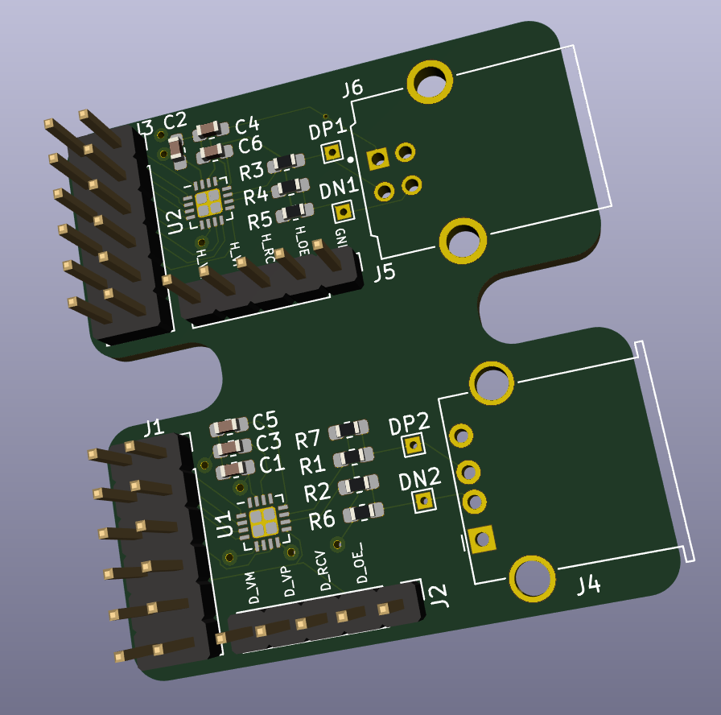

# USB_PMOD

Different PMODs based on an STUSB03E PHY for USB host or USB device.

Beware: PCBs are currently untested, and the host-only PMOD will definitely
not work because it doesn't have 5V wired up correctly!

