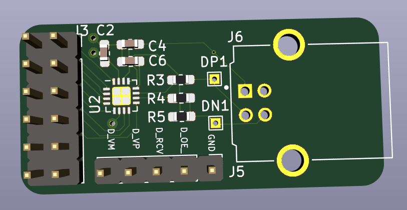

# USB_PMOD

Different PMODs based on an [STUSB03E PHY](https://www.st.com/en/interfaces-and-transceivers/stusb03e.html) 
for USB host or USB device.

**Beware: PCBs are currently untested, and host modes will definitely
not work because it doesn't have 5V wired up correctly!**

