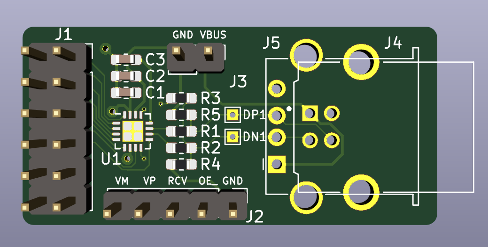

# USB Combo PMOD

It's common to implement Full Speed or Low Speed (FS/LS) USB host or device controllers
on an FPGA by just using their digital IOs, configured as 3V3 LVCMOS. 

A good example is the [TinyFPGA BX board](https://www.adafruit.com/product/4038), 
which comes by default with a hardware-only USB device controller that's used to program new bitstreams into flash. 

Another one is [Fomu](https://www.crowdsupply.com/sutajio-kosagi/fomu), another FPGA development
board that's about as tiny as the USB Type-A connector itself.

However, on FPGAs such as those from the MAX10 family, this solution doesn't work: at
3V3, their IOs don't have the required driving strength. (Only 2mA for a 3V3 LVCMOS IO
on a MAX10.)

For those cases, the easiest FS/LS solution is to use an 
[STUSB03E PHY](https://www.st.com/en/interfaces-and-transceivers/stusb03e.html) for USB host or USB device.
It's a tiny little chip that translates regular digital signals as low as 1.6V to 
USB standard compliant signaling levels.

This project is a PMOD compatible module that contains an STUSB03E, 
the necessary passive components around it, as well as a USB Type-A or
USB Type-B connector footprint.

You need to decide up front whether to use PMOD for USB host or device
purposes, and change the soldered components accordingly.

It's a 4-layer PCB which is overkill, but there's currently no cost difference between
2 and 4 layer PCBs at [JLCPCB](https://jlcpcb.com), so I didn't spend any time to make
it work with 2 layers. It's definitely doable though!

## Instructions

Load the project with KiCAD, or check out a PDF of the schematic [here](./usb_combo_pmod_schematic.pdf)

Use a USB Device:

* Populate J4 (USB B connector) and R3 (if LS support required)
* Don't populate: R4, R5, J5 (USB A connector)
* Don't connect the J3-VBUS pin to anything! (The 5V will come from the USB cable.)

Use as USB Host:

* Populate J5, R4, R5
* Don't populate: J4, R3
* Connect the J3-VBUS pin to an external +5V supply

## BOM

